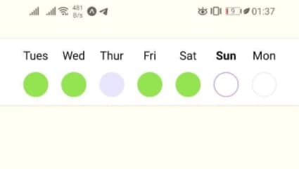

# Streak bar usage & testing

Streak bar gives a user a clear visual of his weekly progress so that he feels motivated to keep up with the app.

## Features

- User week begins the same day he started with the program.  
  Assuming that the input data are already ordered
- Current Day has a day abbreviation in bold font.  
  If any task is completed on that day, the daily circle turns green, otherwise it remains with purple stroke and white background.
- Daily circle turns green, if any task for that day is done, otherwise it turns muted purple (with background).
- The following days are colored in a neutral color.

  

## Setup

**Setup project and install dependencies**

1. Install Expo CLI  
   To start with the demonstration app Expo should be already installed.

   ```
   > npm install -g expo-cli
   ```

   Refer to Expo [Documentation](https://reactnative.dev/docs/environment-setup) for more details.

1. Install project dependencies  
   Run the following npm command in a package (root) directory
   ```
   > npm install
   ```

## Usage & Testing

1. Once the project is set up, run it using:

   ```
   > expo start
   ```

1. Use emulators or Expo Client app to test the application on android / iOS devices.  
   From Expo [Documentation](https://reactnative.dev/docs/environment-setup):

   > Install the Expo client app on your iOS or Android phone and connect to the same wireless network as your computer. On Android, use the Expo app to scan the QR code from your terminal to open your project. On iOS, use the built-in QR code scanner of the Camera app.

1. Use different test scenarios to see how the Streak Bar behaves depending on different input data.
   - The predefined test data are located in the `data` directory:
     ```
     root
     │
     └───data
           test-data1.json
           test-data2.json
           test-data3.json
     ```
   - **Configure** one of the scenarios to be used in `app.config.js` configuration file:
     ```
     extra: {
       // use different test scenarios test-data1 thru test-data3
       testScenario: require('./data/test-data1.json'),
     },
     ```

## Possible future enhancements & ideas:

The current implementation uses the react-native-circles package (MIT licensed), which in turns uses react-native-svg package.  
Here is an example:

- 

The current implementation makes it relatively easy to implement a visual representation of more precise progress, for example, as it has been already done on Udemy (an e-learning platform) to display progress on a course:

- 
